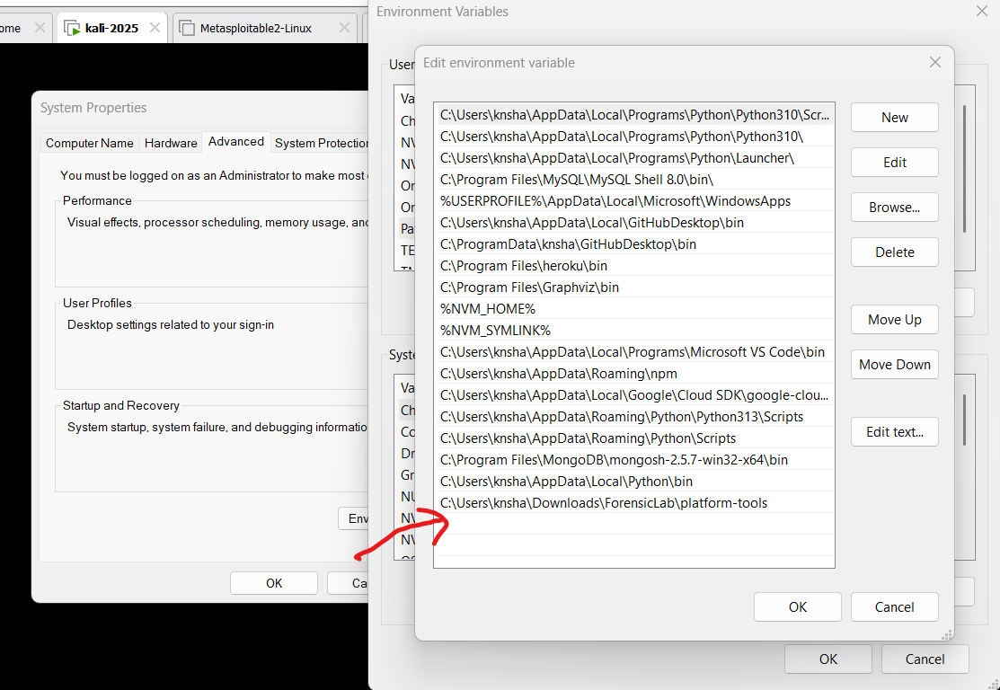
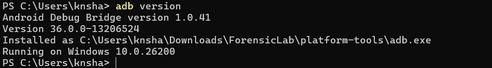
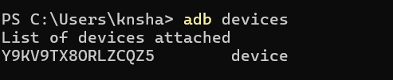
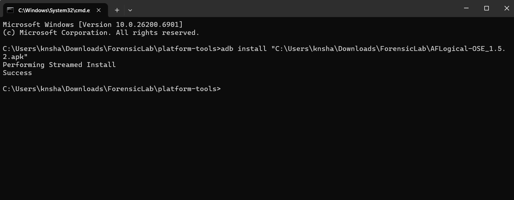
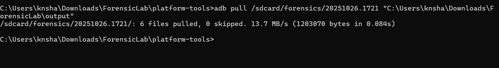
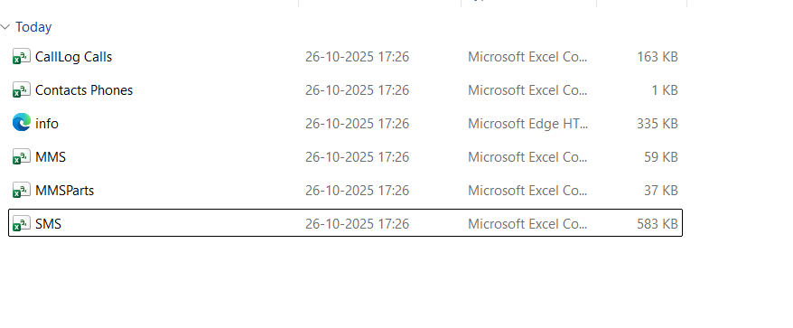

# 🧪 Ex.No.7: Use AFLogical OSE to Extract Data from an Android Device

**Description**

**AFLogical OSE (Open Source Edition)** is a forensic tool used to perform **logical extraction** of data from Android devices — retrieving information like contacts, call logs, and SMS messages **without direct access to the full file system**.  
It is part of the **Open Source Android Forensics** toolkit and often used in forensic investigations or academic labs.

---

## ⚙️ STEP 1 — Extract All ZIP Files

📦 **Files you should have already downloaded:**
- [Android Platform Tools (ADB)](https://developer.android.com/tools/releases/platform-tools)
- [AFLogical OSE ZIP (source or APK)](https://sourceforge.net/projects/santoku/)
- [Google USB Driver (for Windows)](https://developer.android.com/studio/run/win-usb)

🪜 **Instructions:**
1. Create a main folder for your lab:
   ```
   C:\ForensicLab
   ```
2. Extract all the downloaded ZIP files into it:
   ```
   C:\ForensicLab\platform-tools\
   C:\ForensicLab\aflogical-ose\
   C:\ForensicLab\usb-driver\
   ```
3. If AFLogical OSE doesn’t include an APK file, use **Santoku Linux** (a digital forensics OS) to extract or build it from the source ZIP.  
   💡 *Santoku automatically includes AFLogical OSE tools.*

---

## ⚙️ STEP 2 — Add `platform-tools` to PATH

🧰 **Purpose:** So you can run `adb` commands from any directory.

🪜 **Steps:**
1. Open:
   ```
   Control Panel → System → Advanced system settings → Environment Variables
   ```
2. Under **User Variables**, select **Path → Edit → New**  
   Add:
   ```
   C:\ForensicLab\platform-tools
   ```
3. Click **OK** to save changes.


✅ **Verify installation:**
```bash
adb version
```
You should see something like:
```
Android Debug Bridge version 1.0.41
```

---

## ⚙️ STEP 3 — Install Google USB Driver (Windows)

🔌 **Required for your PC to detect the Android device.**

🪜 **Steps:**
1. Connect your Android phone via USB.
2. Open **Device Manager** → find your phone.
3. Right-click → **Update Driver** → **Browse my computer** →  
   Select:
   ```
   C:\ForensicLab\usb-driver
   ```
4. Click **Next** to install the driver.

✅ **Verify:** Run
```bash
adb devices
```
If your phone appears in the list, the driver works.


---

## ⚙️ STEP 4 — Enable Developer Options on the Phone

🪜 **Steps:**
1. On your phone:
   ```
   Settings → About phone → Tap Build number 7 times
   ```
2. Go back:
   ```
   Settings → Developer options
   ```
3. Enable:
   - ✅ **USB Debugging**
   - ✅ **Install via USB** (if available)

---

## ⚙️ STEP 5 — Connect Phone and Check ADB Connection

🔗 **Purpose:** Ensure communication between PC and phone.

🪜 **Steps:**
1. Connect your phone using a **data cable**.
2. In CMD or PowerShell:
   ```bash
   adb devices
   ```
3. If prompted on your phone, tap **Allow USB debugging**.

✅ Expected output:
```
List of devices attached
ABCDEF123456    device
```

If it shows *unauthorized*, replug and allow access again.

---

## ⚙️ STEP 6 — Install AFLogical on the Phone

📲 **Purpose:** Install the forensic extraction app (APK) onto the Android device.

🪜 **Steps:**
1. Ensure you have the APK file ready:
   ```
   C:\ForensicLab\aflogical-ose\AFLogical-OSE.apk
   ```
   *(If not present, extract/build from the AFLogical OSE ZIP using Santoku Linux.)*

2. In CMD:
   ```bash
   adb install C:\ForensicLab\aflogical-ose\AFLogical-OSE.apk
   ```
3. Wait for:
   ```
   Success
   ```
   

✅ **Verification:** Check your phone — the **AFLogical** app should now appear in your app list.

---

## ⚙️ STEP 7 — Run AFLogical OSE on the Phone

📱 **Purpose:** Start the logical data extraction process.

🪜 **Steps:**
1. Open the **AFLogical** app on the device.
2. Grant all requested permissions (Contacts, SMS, Storage).
3. Select which data to extract:
   - ☑️ Contacts  
   - ☑️ SMS  
   - ☑️ Call Logs  
   - ☑️ MMS  
   - ☑️ Calendar
4. Tap **Start Extraction** or **Create Extract**.
5. Wait until extraction finishes.

🗂️ **Default save location:**
```
/sdcard/aflogical/
```
or
```
/storage/emulated/0/aflogical/
```

✅ **Verify via ADB:**
```bash
adb shell ls /sdcard/aflogical
```
You should see:
```
contacts.csv
sms.csv
calllog.csv
```

---

## ⚙️ STEP 8 — Copy Extracted Data to Your Computer

💾 **Purpose:** Pull the extracted forensic data to your analysis workstation.

🪜 **Command:**
```bash
adb pull /sdcard/aflogical C:\ForensicLab\output
```


✅ This copies the folder from your phone to:
```
C:\ForensicLab\output\
```

Check using:
```bash
dir C:\ForensicLab\output
```

You’ll find files like:
```
contacts.csv
sms.csv
calllog.csv
mms.csv
calendar.csv
```

---

## 🧠 (Optional) STEP 9 — Verify Integrity (Hash Values)

To maintain forensic integrity, calculate file hashes.

**Windows (PowerShell):**
```powershell
Get-FileHash "C:\Users\knsha\Downloads\ForensicLab\output\20251026.1721\Contacts Phones.csv" -Algorithm SHA256
```

**Linux/macOS:**
```bash
sha256sum ~/ForensicLab/output/contacts.csv
```

Record the hash in your report.

---

## 🧹 STEP 10 — Clean Up

**After extraction is complete:**

🪜 **Uninstall AFLogical (optional):**
```bash
adb uninstall com.viaforensics.android.aflogical
```

🪜 **Safely disconnect your device.**

---

## 📋 Summary of Useful ADB Commands

| Purpose | Command |
|----------|----------|
| Check ADB version | `adb version` |
| List connected devices | `adb devices` |
| Install APK | `adb install <path_to_apk>` |
| List phone storage | `adb shell ls /sdcard/` |
| Check AFLogical folder | `adb shell ls /sdcard/aflogical` |
| Pull data to PC | `adb pull /sdcard/aflogical C:\ForensicLab\output` |
| Uninstall AFLogical | `adb uninstall com.viaforensics.android.aflogical` |

---

## 🔗 Reference Links

- 📦 **Android Platform Tools (ADB):** [https://developer.android.com/tools/releases/platform-tools](https://developer.android.com/tools/releases/platform-tools)
- 🧩 **Santoku Linux (Forensics Toolkit with AFLogical):** [https://sourceforge.net/projects/santoku/](https://sourceforge.net/projects/santoku/)
- 🪟 **Google USB Driver (Windows):** [https://developer.android.com/studio/run/win-usb](https://developer.android.com/studio/run/win-usb)


---

✨ **End of Experiment**

You have successfully performed **logical extraction** from an Android device using **AFLogical OSE** and documented the forensic process completely.
